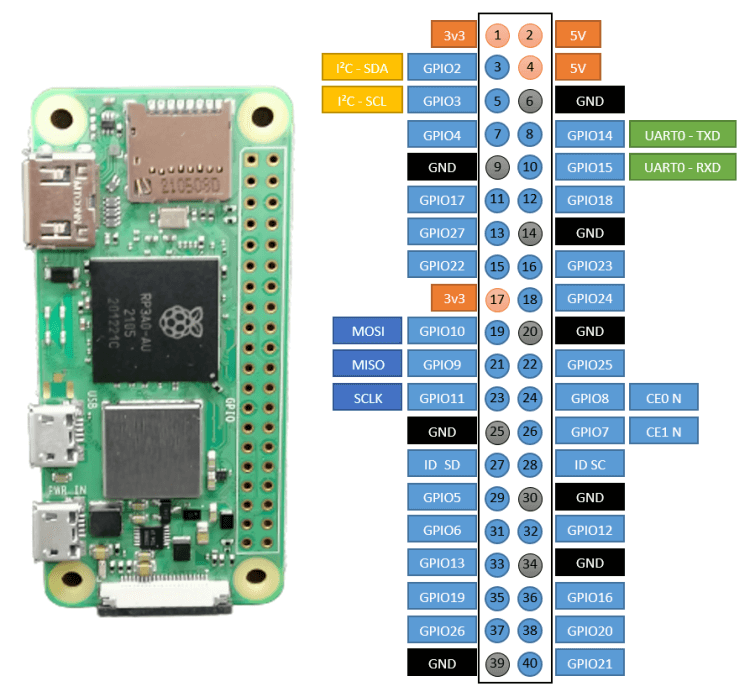

# VeggieVision Firmware

A [Nerves](https://nerves-project.org/)-based firmware project for monitoring soil moisture using a Raspberry Pi Zero 2W and LM393 Soil Hygrometer Moisture Sensor.

## Overview

VeggieVision is an embedded Elixir application built with the [Nerves](https://nerves-project.org/) framework that continuously monitors soil moisture levels using an LM393 Soil Hygrometer Moisture Sensor. The project runs on a Raspberry Pi Zero 2W and communicates with the sensor via I2C protocol. The system automatically transmits humidity data to a remote HTTP server for data collection and analysis.

## Hardware Components

- **Board**: Raspberry Pi Zero 2W
- **Sensor**: LM393 Soil Hygrometer Moisture Sensor (Analog Output)
- **Communication**: I2C protocol
- **I2C Address**: 0x2
- **I2C Bus**: i2c-1

### Raspberry Pi Zero 2 W Pinout



## Software Stack

- **Framework**: [Nerves Project](https://nerves-project.org/)
- **Language**: Elixir
- **I2C Library**: Circuits.I2C
- **HTTP Client**: Req
- **Architecture**: Supervisor pattern for process management

## Project Structure

```
veggie_vision_firmware/
├── README.md
├── veggie_vision.ex
└── images/
    └── raspberry_pi_zero_2_w_pinout.png
```

## Code Overview

The main module `VeggieVision` implements:

- **Supervisor Pattern**: Manages the I2C communication process
- **Periodic Monitoring**: Reads sensor data every 15 minutes (900,000ms)
- **HTTP Data Transmission**: Automatically sends humidity data to a configured HTTP server
- **Error Handling**: Graceful handling of I2C bus failures and HTTP communication issues
- **Data Processing**: Reads 2 bytes from the sensor and processes the moisture data

### Key Features

- Automatic I2C bus initialization
- Periodic soil moisture monitoring (15-minute intervals)
- HTTP data transmission to remote server
- Comprehensive error logging for I2C and HTTP communication
- Supervisor-based process management for reliability

## Configuration

### Server Configuration

The firmware is configured to send humidity data to an HTTP server. Update the `@server_url` variable in `veggie_vision.ex`:

```elixir
@server_url "http://<IP_ADDRESS>:4000/store"
```

Replace `<IP_ADDRESS>` with your server's IP address or domain name.

### Measurement Interval

The current measurement interval is set to 15 minutes (900,000ms). This can be adjusted by modifying the `@measurement_interval` variable:

```elixir
@measurement_interval 900_000  # 15 minutes in milliseconds
```

## Usage

The firmware automatically starts when deployed to the Raspberry Pi Zero 2W. The system will:

1. Initialize I2C communication with the soil moisture sensor
2. Read sensor data every 15 minutes
3. Transmit humidity values to the configured HTTP server
4. Log all activities and errors to the console

## Data Transmission

The firmware sends humidity data via HTTP GET requests to the configured server endpoint. The data is transmitted as a query parameter:

```
GET /store?hum=<humidity_value>
```

The server should be configured to handle these requests and store or process the humidity data as needed.

## Sensor Integration

The LM393 Soil Hygrometer Moisture Sensor provides analog output that is read through the I2C interface. The sensor detects soil moisture levels and provides periodic monitoring capabilities for agricultural or gardening applications.

## Development

This project is designed for embedded applications using the [Nerves](https://nerves-project.org/) framework, providing a robust and reliable solution for soil moisture monitoring in IoT applications with remote data collection capabilities.
